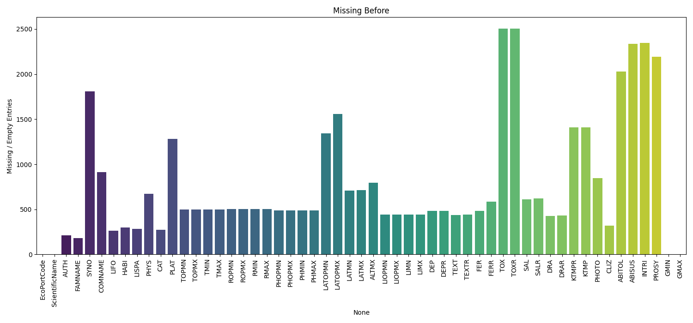

# Gardener App Documentation

## [Work in Progress] Retrieval-Augmented Generation (RAG)

### Ziel des RAG-Moduls

Das RAG-Modul erweitert die Gardener App um die Fähigkeit, **kontextbasierte Antworten** auf Nutzereingaben zu generieren. Hierbei werden strukturierte Informationen aus der EcoCrop-Datenbank mit modernen Sprachmodellen kombiniert.

**Use Cases:**

* Fragen zur Klima-, Boden- oder Salztoleranz einer Pflanze
* Empfehlung von Pflanzen basierend auf Umweltbedingungen
* Kontextuelles Erklären von Eignungen und Wachstumsbedingungen

---

### Architekturüberblick

#### 1. **Preprocessing Pipeline**

* Bereinigt und normalisiert die Rohdaten aus `EcoCrop_DB.xlsx` bzw. dem dbt-Modell
* Extrahiert Listenfelder (`COMNAME`, `CAT`, `CLIZ`, …)
* Berechnet Zusatzmerkmale wie `IS_DROUGHT_TOLERANT`, `PH_RANGE_WIDTH`, `ADAPTABILITY_SCORE`

#### 2. **Chunking & Embedding**

* Jede Pflanze wird als RAG-kompatibler Dokumenten-Chunk (`.txt`) exportiert
* Einbettung erfolgt über  **bge-m3**
* Speicherung der Vektoren und zugehöriger Metadaten in **Milvus**

#### 3. **RAG Query Pipeline**

* Eingabe der Nutzerfrage → Transformation in einen Vektor
* Hybrid-Suche in Milvus (semantische Ähnlichkeit + Filter)
* Top-Dokumente werden als Kontext an ein LLM übergeben
* Antwort wird generiert und zurückgegeben

---

### Komponenten

| Datei / Modul              | Funktion                                       |
| -------------------------- | ---------------------------------------------- |
| `field_parser.py`          | Parser für Listen- und Kategoriefelder         |
| `transform_ecocrop_data()` | Bereinigt & transformiert Pflanzendaten        |
| `generate_rag_document()`  | Erstellt ein RAG-Chunk aus einer Pflanzenzeile |
| `export_rag_chunks()`      | Exportiert `.txt`-Dateien je Pflanze           |
| `rag_router.py`            | FastAPI-Endpunkt für RAG-Queries               |
| `vector_store/`            | Indexierung der Embeddings in Milvus           |

---

### Beispiel für einen RAG Chunk

```text
**South Queensland kauri** — Adaptability: **Moderate** (score: 0.65)
Common names: South Queensland kauri
Use categories: forest/wood
 Climate zones: tropical, humid
 Subscores — Climate: 0.80, Soil: 0.50, Water: 0.65
 Temperature: Optimal 20–30°C | Absolute: 10–40°C
 Precipitation: Optimal 1000–2000 mm | Absolute: 800–2500 mm
 Traits: drought-tolerant, fire-susceptible, temperature-flexible
 Growth cycle: 180 days
```

---

### Beispiel-Query

**Frage:**

> „Welche Pflanzen eignen sich für sandige Böden mit wenig Wasser?“

**Ablauf:**

1. Nutzerfrage → Vektor
2. Suche in Milvus mit Metadatenfiltern:

   ```python
   filter="IS_DROUGHT_TOLERANT == true AND TEXT_LIST like '%sandy%'"
   ```
3. Top-Chunks + Frage an LLM → Antwort

**Beispiel-Antwort (LLM):**

> "Für sandige, wasserarme Böden eignen sich besonders *Agave americana*, *Atriplex halimus* und *Opuntia ficus-indica*. Diese Arten sind trockenheitsresistent und gedeihen gut in leichten, durchlässigen Böden."

---

## Nächste Schritte (To-Do)

### **1. SQL Layer (Strukturierte Filterung via dbt)**

* [ ] Existierendes dbt-Schema aktiv für RAG-Preprocessing verwenden
* [ ] Modell `plants_rag_ready` erstellen (vollständige, bereinigte Pflanzen)
* [ ] dbt-Views für UI-relevante Filterlogik (z. B. kurze Zyklen, PH-Toleranz)
* [ ] `schema.yml` mit Tests ergänzen (`not_null`, `accepted_values`)
* [ ] `read_sql()` im RAG-Export statt Excel-Datei nutzen

### **2. Metadata Filtering (Milvus Hybrid Queries)**

* [ ] Speichere Metadaten wie `CLIZ_LIST`, `TEXT_LIST`, `ADAPTABILITY_LABEL`, `IS_DROUGHT_TOLERANT` direkt in Milvus
* [ ] Füge Filter-Syntax in Vektor-Suchlogik ein

### **3. Vector Embedding Layer**

* [ ] Vollständiger Informationsgehalt in RAG Chunks
* [ ] Format von RAG Chunks überarbeiten


### **4. Optional: BM25 / Keyword Layer**

* [ ] Fallback-Suche mit ElasticSearch / Whoosh
* [ ] Speziell für exakte Begriffe oder juristisch/technisch relevante Anfragen

### **5. Knowledge Graph (optional, mittelfristig)**

* [ ] Modellierung von Relationen (Verwandtschaft, Alternativen, Regionen)
* [ ] Integration als reasoning layer bei komplexen Abfragen

### **6. LLM Prompt Layer**

* [ ] Templates für Frage-Typen: Vergleich, Empfehlung, Erklärung
* [ ] Kombination aus Top-N Kontext + expliziten Filtern
* [ ] Deutsch & Englisch im Prompt unterstützen

### **7. UI & Monitoring**

* [ ] Interaktive Filter für: pH-Wert, Temperaturspanne, Zykluslänge, Klimazone
* [ ] Logging und Metriken für RAG (z. B. Trefferqualität, Precision\@k)
* [ ] Segmentiertes Monitoring (z. B. Performance pro Pflanzentyp)


## Inhaltsverzeichnis
1. [Motivation und Zweck der Gardener App](#1-motivation-und-zweck-der-gardener-app)
2. [Gesamtarchitektur](#2-gesamtarchitektur)
   1. [Backend](#21-backend)
   2. [Data-Tier](#22-data-tier)
   3. [Frontend](#23-frontend)
3. [Backend](#3-backend)
   1. [Datensatzaufbereitung](#31-datensatzaufbereitung)
      1. [Schritte der Datenaufbereitung](#311-schritte-der-datenaufbereitung)
   2. [Wetterdaten Handling](#32-wetterdaten-handling)
   3. [Suitability Score](#33-suitability-score)
      1. [Temperatur-Eignungspunktzahl](#331-temperatur-eignungspunktzahl)
      2. [Niederschlagseignungspunktzahl](#332-niederschlagseignungspunktzahl)
      3. [Kombinierter Suitability Score](#333-kombinierter-suitability-score)
   4. [Datenbankhandling](#34-datenbankhandling)
   5. [REST API](#35-rest-api)
   6. [Swagger-UI und API-Dokumentation](#36-swagger-ui-und-api-dokumentation)
4. [Data-Tier](#4-data-tier)
   1. [Datenmodell (models.py)](#41-datenmodell-modelspy)
5. [Frontend](#5-frontend)
   1. [Visualisieren der Wetterdaten](#51-visualisieren-der-wetterdaten)
   2. [Handling von LLM Prompting und Prompt Engineering](#52-handling-von-llm-prompting-und-prompt-engineering)
6. [Deployment mit Kubernetes](#6-deployment-mit-kubernetes)
   1. [Architekturübersicht](#61-architekturübersicht)
   2. [Komponenten](#62-komponenten)
   3. [Kubernetes-Ressourcen](#63-kubernetes-ressourcen)
   4. [Anpassungen der Deployment Pipeline](#64-anpassungen-der-deployment-pipeline)
7. [Quellen](#7-quellen)


## 1. Motivation und Zweck der Gardener App
Die Motivation der Gardener App liegt zum einen im Eigeninteresse verschiedene Gartenpflanzen anzubauen, zum Anderen in der Inspiration durch den Einsatz von AI basierten Tools in der Landwirtschaft. Es gibt beispielsweise von Microsoft eine Lösung die indischen Farmern Tipps für u.a. Aussähzeitpunkt, Wahl des Cultivars, Düngung bietet.


Auf dem obigen Foto eines einfachen Handys, das die Anbautipps per SMS empfängt, ist die [Anwendung von Microsoft](https://news.microsoft.com/en-in/features/ai-agriculture-icrisat-upl-india/) in der Praxis zu sehen. 
Die Einfachheit der Anwendung mit einem gleichzeitig sehr komplexen Backend war die initiale Motivation für die Gardenener App. Es soll somit ein ähnliches Ziel, nämlich die datenbasierte Pflanzenzucht für technisch, fachlich ungeschulte Benutzer unter vereinfachten Bedingungen erreicht werden.
Die Hauptsäule der App liegt in der Nutzung der EcoCrop-Datenbank, die von der UN entwickelt wurde und eine umfassende Sammlung klimatischer Anforderungen für eine Vielzahl von Pflanzenarten enthält. Die Komplexität des vollständigen EcoCrop-Modells ist jedoch zu hoch und die Datenbank möglicherweise u.a. deswegen nicht mehr in Benutzung. Das ist schade, da es sich immer noch um einen der besten frei zugänglichen Datensätze mit Pflanzenbedürfnissen handelt. Es ist sogar der einzige frei verfügbare, passende Datensatz der bei der Recherche zum Projekt gefunden wurrde.
Mit einer vereinfachten  Berechnung des Suitability Scores für die Eignung einer Pflanze unter den gegebenen klimatischen Bedingungen wird so ein echter Nutzen geboten.

Zusammengefasst ist das Ziel der App die Bestimmung der Eignung einer Pflanze zum Anbau vor Ort im Freien mit einer benutzerfreundlichen UI, deren informativer Output speziell auf die Bedürfnisse von amateuerhaften Gärtnern zugeschnitten ist.
## 2. Gesamtarchitektur
### 2.1 Backend
Erreichbar unter: https://plantsapi-13434.edu.k8s.th-luebeck.dev/
Das Backend der Gardener App ist darauf ausgelegt, die Hauptlogik der Anwendung zu handhaben, einschließlich der Verarbeitung von Pflanzendaten und Wetterinformationen sowie der Berechnung der Eignungsbewertung (Suitability Score). Mit einer REST API für Pflanzeneinträge, sowie weiteren Routen u.a. für die Berechnung des Suitability Score einer Pflanze liefert das Backend dem Frontend geeignete Schnittstellen. Der Ausgangsdatensatz wird vom Backend bei Programmstart transformiert und in die Datenbank geladen.

### 2.2 Data-Tier
Das Data-Tier bildet den EcoCrop Datensatz, der aus eine Tabeller voller Pflanzendaten besteht, als PostgreSQL Tabelle ab. Diese ist für das Backend über einen Zugang zur Datenbank und SQLAlchemy verfügbar.

### 2.3 Frontend
Erreichbar unter: https://gardener-13434.edu.k8s.th-luebeck.dev/
Das Frontend benutzt die vom Backend bereitgestellte API um die Daten für die vom Nutzer gewählte Kombination aus Standort und Pflanze in ein LLM zu übergeben.
Außerdem werden die Pflanzendaten für den Nutzer dargestellt, als Download angeboten und die Wetterdaten als Graph visualisiert.
## 3. Backend
### 3.1 Datensatzaufbereitung

Die EcoCrop-Datenbank, die umfangreiche Informationen zu den klimatischen Anforderungen vieler Pflanzen enthält, wird vor der Nutzung in der App umfassend aufbereitet. Diese Aufbereitung umfasst die Bereinigung und Transformation der Daten, um sicherzustellen, dass sie den Anforderungen der App entsprechen.

#### 3.1.1 Schritte der Datenaufbereitung:

1. **Erkennung und Visualisierung von fehlenden Werten**:  
   Zunächst wird eine Analyse der fehlenden oder leeren Werte in den verschiedenen Feldern durchgeführt. Dabei werden fehlende Werte (NA) und leere Strings kombiniert und die Anzahl der fehlenden Werte für jede Spalte visualisiert. Vor der Transformation sah die Verteilung der fehlenden Werte folgendermaßen aus:

   

2. **Bereinigung von Werten**:  
   Die Bereinigung erfolgt in mehreren Schritten:
   - **Schritt 1**: Entfernen von Einträgen, bei denen der Wert von `TOPMN` (minimale optimale Temperatur) über 40°C liegt. In diesem Schritt wurde 1 Eintrag entfernt.
   - **Schritt 2**: Für Zeilen, in denen `KTMP` (Kälte-Toleranz-Temperatur) fehlt, wird dieser Wert mit `TMIN - 5°C` (5 Grad unter der minimalen Temperatur) ersetzt. Insgesamt wurden in 1410 Zeilen die fehlenden KTMP-Werte gefüllt.
   - **Schritt 3**: Prüfung und Bereinigung der Breitenkoordinaten. Für Felder mit Breitenwerten (`LATOPMN`, `LATOPMX`, `LATMN`, `LATMX`), die außerhalb des gültigen Bereichs von -90 bis 90 Grad liegen, wurden die Werte als ungültig markiert und auf NA gesetzt. Dies betraf:
     - 2 Einträge in `LATOPMN`,
     - 3 Einträge in `LATOPMX`,
     - 5 Einträge in `LATMN`,
     - 7 Einträge in `LATMX`.
   - **Schritt 4**: Fehlende oder leere Werte für `GMAX` (maximale Wachstumsperiode) und `GMIN` (minimale Wachstumsperiode) wurden standardmäßig auf 0 gesetzt. Dies betraf 2 Einträge in `GMAX`.

3. **Entfernung unvollständiger Zeilen**:  
   Nachdem alle oben genannten Bereinigungen durchgeführt wurden, wurden alle Zeilen entfernt, die immer noch NA-Werte in den relevanten Feldern (`TOPMN`, `TOPMX`, `TMIN`, `TMAX`, `ROPMN`, `ROPMX`, `RMIN`, `RMAX`, `GMIN`, `GMAX`, `KTMP`) enthalten. In diesem Schritt wurden insgesamt 505 Zeilen entfernt.

   Nach der Transformation enthält der bereinigte Datensatz 2062 Zeilen.

4. **Visualisierung der bereinigten Daten**:  
   Nach der Bereinigung wurden erneut die fehlenden Werte visualisiert, um sicherzustellen, dass keine relevanten Felder mehr unvollständige Daten enthalten.

   

5. **Analyse der numerischen Felder**:  
   Eine weitere Analyse der Werteverteilungen der numerischen Felder wurde nach der Transformation durchgeführt. Diese Boxplot-Analyse gibt einen Überblick über die Verteilung der Temperatur- und Niederschlagsgrenzwerte (`TOPMN`, `TOPMX`, `TMIN`, `TMAX`, `ROPMN`, `ROPMX`, `RMIN`, `RMAX`, `GMIN`, `GMAX`, `KTMP`).

   

   Eine detaillierte Zusammenfassung der durchgeführten Bereinigungen und Transformationen ist in der Datei [transformation_summary.txt](backend/resources/data-report/transformation_summary.txt) verfügbar.

### 3.2 Wetterdaten Handling
Das Backend ruft historische Wetterdaten der letzten 30 Tage von der Open Meteo API ab und verarbeitet diese, um sie in die Berechnung des Suitability Scores einfließen zu lassen. Die benutzte API-URL lautet: 
`https://archive-api.open-meteo.com/v1/archive?latitude={latitude}&longitude={longitude}&start_date={start_date}&end_date={end_date}&daily=temperature_2m_max,temperature_2m_min,temperature_2m_mean,precipitation_sum`
Die Benutzung der Forecast API war ursprünglich zusätzlich enthalten, wurde aber im Projektverlauf entfernt, da die empfangenen stündlichen Wetterdaten oft unvollständig waren.
### 3.3 Suitability Score
Der Suitability Score wird basierend auf den abgerufenen Wetterdaten und den Anforderungen der Pflanzenarten berechnet. Dabei wird eine vereinfachte Methode verwendet, um eine schnelle und dennoch aussagekräftige Bewertung zu ermöglichen.

#### 3.3.1 **Temperatur-Eignungspunktzahl**

Die Temperatur wird auf täglicher Basis in drei Parametern bewertet:
- **Tageshöchsttemperatur (max)**: `temperature_2m_max`
- **Tagesminimumtemperatur (min)**: `temperature_2m_min`
- **Tagesdurchschnittstemperatur (mean)**: `

temperature_2m_mean`

Für jede dieser drei Temperaturen wird ein Punktwert (0–100) auf Grundlage der optimalen und maximal/minimal tolerierbaren Temperaturen der Pflanze berechnet:

**Formel für die Temperatur-Eignung:**
- Innerhalb des optimalen Temperaturbereichs: Punktzahl = 100
- Außerhalb, aber innerhalb der Toleranz: Die Punktzahl nimmt linear ab von 100 auf 50, je nachdem, wie weit die Temperatur vom optimalen Bereich entfernt ist.
- Bei Temperaturen außerhalb der Toleranz: Die Punktzahl sinkt auf 0.

Die vollständige Formel lautet:
```python
if plant.TOPMN <= temperature <= plant.TOPMX:
    temp_score = 100  # Perfekt innerhalb des optimalen Bereichs
elif plant.TMIN <= temperature < plant.TOPMN:
    temp_score = 50 + 50 * (temperature - plant.TMIN) / (plant.TOPMN - plant.TMIN)  # Linearer Abfall
elif plant.TOPMX < temperature <= plant.TMAX:
    temp_score = 50 + 50 * (plant.TMAX - temperature) / (plant.TMAX - plant.TOPMX)  # Linearer Abfall
else:
    deviation = abs(temperature - (plant.TMAX if temperature > plant.TMAX else plant.TMIN))
    temp_score = max(0, 100 - deviation * 10)  # Starkes Absinken bei extremen Abweichungen
```

Die Eignung der täglichen Temperatur wird als Mittelwert der Punktzahlen für die **maximale**, **minimale** und **durchschnittliche** Temperatur berechnet:
```python
temp_score = (temp_mean_score + temp_min_score + temp_max_score) / 3
```

#### 3.3.2. **Niederschlagseignungspunktzahl**

Der Niederschlag wird über einen Zeitraum von 30 Tagen summiert und auf ein Jahr hochgerechnet. Der jährliche Niederschlag wird dann mit den optimalen und minimal/maximal tolerierbaren Niederschlagsmengen der Pflanze verglichen.

**Formel für die Niederschlagseignung:**
- Innerhalb des optimalen Niederschlagsbereichs: Punktzahl = 100
- Außerhalb, aber innerhalb der Toleranz: Punktzahl = Linearer Abfall von 100 auf 50
- Außerhalb der Toleranz: Punktzahl = Lineares Absinken auf 0

```python
if plant.ROPMN <= annualized_precipitation <= plant.ROPMX:
    precip_score = 100  # Perfekt innerhalb des optimalen Bereichs
elif plant.RMIN <= annualized_precipitation < plant.ROPMN:
    precip_score = 50 + 50 * (annualized_precipitation - plant.RMIN) / (plant.ROPMN - plant.RMIN)
elif plant.ROPMX < annualized_precipitation <= plant.RMAX:
    precip_score = 50 + 50 * (plant.RMAX - annualized_precipitation) / (plant.RMAX - plant.ROPMX)
else:
    deviation = abs(annualized_precipitation - (plant.RMAX if annualized_precipitation > plant.RMAX else plant.RMIN))
    precip_score = max(0, 100 - deviation * 10)  # Starkes Absinken bei extremen Abweichungen
```

#### 3.3.3 **Kombinierter Suitability Score**

Der Suitability Score für jeden Tag basiert auf dem Mittelwert der Temperatur- und Niederschlagseignungen. Der endgültige Suitability Score ist der Durchschnitt der täglichen Werte über den betrachteten Zeitraum (30 Tage):
```python
daily_score = (temp_score + precip_score) / 2
final_suitability_score = sum(suitability_scores) / len(suitability_scores)
```

### 3.4 Datenbankhandling
Die Anwendung überprüft die Datenbank auf vorhandene Einträge und lädt die erforderlichen Daten aus der CSV-Datei, wenn Einträge fehlen. Dies gewährleistet, dass die Datenbank stets die notwendigen Informationen für die Berechnungen enthält. 
Die für den Verbindungsaufbau zur Datenbank benötigten Parameter werden als Umgebungsvariablen geladen.(siehe /backend/app/database.py)
### 3.5 REST API
Die REST API ist mit FastAPI im Backend umgesetzt und stellt verschiedene Endpunkte bereit, über die das Frontend zum einen das Pflanzen-Modell mit CRUD Operationen anspricht, sowie die Berechnung von Suitability Scores abruft.
### 3.6 Swagger-UI und API-Dokumentation
Die REST API des Backends ist automatisch mittels einer **Swagger-UI** dokumentiert. Die Swagger-Dokumentation kann unter folgendem Link aufgerufen werden:  
[Swagger Dokumentation der plants API](https://plantsapi-13434.edu.k8s.th-luebeck.dev/docs)

## 4. Data-Tier
### 4.1 Datenmodell (models.py)
Das Datenmodell der App basiert auf SQLAlchemy und repräsentiert in einer einzigen Tabelle die ecocrop Datenbank mit unveränderten Datentypen.

## 5. Frontend
### 5.1 Visualisieren der Wetterdaten
Das Frontend visualisiert die historischen Wetterdaten der letzten 30 Tage in einem anschaulichen Diagramm, um den Benutzern ein besseres Verständnis der klimatischen Bedingungen zu ermöglichen. Das Diagramm hat eine doppelte Beschriftung der y-Achse für Niederschlag und Temperatur. Die X-Achse zeigt die Zeitspanne der 30 Tage.

### 5.2 Handling von LLM Prompting und Prompt Engineering

In der Gardener App wird ein **Large Language Model (LLM)** verwendet, um personalisierte und benutzerfreundliche Berichte zu generieren, die den Nutzern wertvolle Einblicke in die Anbaubedingungen für ihre Pflanzen geben. Dies geschieht durch ein **Prompt Engineering**, bei dem sorgfältig gestaltete Vorlagen verwendet werden, um die Ausgaben des Modells auf die spezifischen Anforderungen der Benutzer abzustimmen. 

#### Verwendetes LLM:
| Name     | Endpunkt-URL                                                                     | LLM           |
|----------|----------------------------------------------------------------------------------|---------------|
| Chat LTS | [https://models.mylab.th-luebeck.dev/v1](https://chat-lts.models.th-luebeck.dev) | Llama 3.3 70B |

Das Modell wird über einen speziell entwickelten **Prompt Template** angesteuert, das sicherstellt, dass die Antworten in einer leicht verständlichen, interaktiven und oft humorvollen Art und Weise präsentiert werden, um die Benutzererfahrung zu verbessern. 

#### Prompt Struktur:
Der Prompt ist so gestaltet, dass er die relevanten Wetterdaten, Pflanzeninformationen und den Suitability Score auf kreative und informative Weise integriert. Der gartenkundige "Gartenzwerg" antwortet den Nutzern mit hilfreichen Tipps, indem er sowohl die klimatischen Bedingungen als auch die geografische Lage in die Analyse einbezieht.

Die App verwendet dabei das LLM, um die Wetterdaten der letzten 30 Tage sowie den berechneten **Suitability Score** zu analysieren und diese Daten in leicht verständlichen Berichten zusammenzufassen. Hierbei werden die optimalen und minimal/maximal tolerierbaren Bedingungen der Pflanze berücksichtigt, um eine fundierte Auswertung der aktuellen Wachstumsbedingungen zu liefern. 

#### Integration im Frontend:
Das Frontend der App ruft das LLM auf, sobald der Benutzer eine Pflanze und eine Lokalisation ausgewählt und mit Klick auf den Button "Calculate Suitability" bestätigt hat. Hierbei werden die Wetterdaten und der Suitability Score an das LLM gesendet, das daraufhin einen vollständigen Bericht erstellt. Dieser wird manuell abgekürzt, da am Ende meist Artefakte/Kauderwelsch auftreten, bspw. Python Code.

## 6. Deployment mit Kubernetes

Das Deployment der Gardener App erfolgt vollständig automatisiert und containerisiert auf einer Kubernetes-Plattform, was die Skalierbarkeit und Flexibilität der App gewährleistet. Dieser Abschnitt beschreibt die Architektur des Deployments, die verwendeten Komponenten sowie deren Zusammenspiel innerhalb der Kubernetes-Umgebung.

### 6.1 Architekturübersicht

Die Gardener App besteht aus drei Hauptkomponenten: dem Frontend, dem Backend und dem Data-Tier (PostgreSQL). Alle Komponenten sind containerisiert und werden in einem Kubernetes-Cluster ausgeführt, wobei der Betrieb durch automatisierte Continuous Deployment-Pipelines ermöglicht wird. Die Kubernetes-Ressourcen werden über Kubernetes-Manifeste beschrieben und mittels GitLab CI/CD automatisch bereitgestellt.

Das folgende Diagramm zeigt die Gesamtarchitektur der App in der Kubernetes-Umgebung:


### 6.2 Komponenten

1. **Frontend**:  
   Das Frontend basiert auf Streamlit und stellt die Benutzeroberfläche bereit, über die der Endnutzer interagiert. Es empfängt Benutzeranfragen über einen Webbrowser, visualisiert Daten und kommuniziert mit dem Backend, sowie dem LLM-Endpunkt über API-Calls. Das Frontend wird über einen Kubernetes-Service bereitgestellt und ist durch einen Ingress-Controller von außen zugänglich. Die Ingress-Rules leiten die HTTP-Anfragen an den entsprechenden Service im Cluster weiter.

2. **Backend (API/Business-Logic)**:  
   Das Backend der Gardener App ist verantwortlich für die Hauptlogik der Anwendung, einschließlich der Verarbeitung von Pflanzendaten, dem Abruf von Wetterdaten und der Berechnung der Suitability Scores. Es kommuniziert mit dem PostgreSQL-Data-Tier, um Pflanzendaten zu speichern und abzurufen, und stellt API-Endpunkte für das Frontend bereit. Auch das Backend wird über einen Kubernetes-Service bereitgestellt und über einen eigenen Ingress von außen erreichbar gemacht.

3. **Data-Tier (PostgreSQL)**:  
   Das PostgreSQL-Datenbanksystem dient als persistent Speicher für alle relevanten Pflanzendaten. Diese Komponente ist nicht öffentlich zugänglich und kommuniziert

 nur mit dem Backend innerhalb des Clusters. Der Datenbestand wird durch ein Persistent Volume (PVC) gesichert, sodass die Daten auch nach einem Neustart des Pods erhalten bleiben.

### 6.3 Kubernetes-Ressourcen

- **Deployments**:  
  Sowohl das Frontend, das Backend als auch der PostgreSQL-Dienst sind als Kubernetes-Deployments konfiguriert, um sicherzustellen, dass die Pods bei Bedarf automatisch skaliert und wiederhergestellt werden. Die Deployments legen fest, wie viele Replikate der jeweiligen Komponente zu jedem Zeitpunkt bereitgestellt werden sollen.
    - **Frontend-Deployment**: Es werden drei Replikate der Streamlit-App betrieben, um eine hohe Verfügbarkeit und Skalierbarkeit zu gewährleisten.
    - **Backend-Deployment**: Auch das Backend besteht aus drei Replikaten, sodass Anfragen parallel verarbeitet und die Last verteilt werden können.
    - **PostgreSQL-Deployment**: Da es sich bei der Datenbank um einen stateful Service handelt, wird lediglich ein Pod bereitgestellt, der mit einem Persistent Volume verbunden ist, um die Daten zu speichern.

- **Services**:  
  Jedes Deployment ist mit einem entsprechenden Kubernetes-Service verbunden, der als interner Load Balancer fungiert. Der Service sorgt dafür, dass die Kommunikation zwischen den Komponenten auch bei veränderten IP-Adressen der Pods stabil bleibt.
    - **Backend-Service**: Verbindet das Backend mit dem PostgreSQL-Service.
    - **Frontend-Service**: Stellt sicher, dass das Frontend mit dem Backend kommunizieren kann.

- **Ingress**:  
  Der Ingress-Controller verwaltet den externen Zugriff auf die App. Zwei separate Ingress-Routen werden konfiguriert:
    - Eine Route für das Frontend unter der Subdomain `gardener-[CI_PROJECT_ID].edu.k8s.th-luebeck.dev`.
    - Eine weitere Route für das Backend unter der Subdomain `plantsapi-[CI_PROJECT_ID].edu.k8s.th-luebeck.dev`.

- **Persistent Volume Claims (PVC)**:  
  Für den PostgreSQL-Datenbankdienst wird ein Persistent Volume verwendet, um die Daten persistent zu speichern. Der entsprechende Volume-Claim stellt sicher, dass der Speicher auch bei Neustarts des Pods erhalten bleibt.

### 6.4 Anpassungen der Deployment Pipeline

Die App wird im Rahmen einer Continuous Deployment Pipeline bereitgestellt, die auf GitLab CI/CD basiert. Diese Pipeline übernimmt den vollständigen Prozess vom Erstellen der Docker-Images über das Hochladen in die Registry bis hin zur Bereitstellung der Ressourcen im Kubernetes-Cluster. Der Deployment-Prozess wurde so angepasst, dass die App automatisch skaliert werden kann und auf Änderungen schnell reagiert. Dies umfasst:
- **Automatisierte Bereitstellung der Container-Images**: Jedes Mal, wenn neue Änderungen in das GitLab-Repository gepusht werden, wird ein neues Docker-Image erstellt und in die Registry gepusht. Anschließend werden die Kubernetes-Ressourcen automatisch aktualisiert.
- **Erstellen von Secrets**: Während der Pipeline wird ein Docker-Registry-Secret erstellt, damit Kubernetes die neuesten Images aus der Registry laden kann.
- **Persistent Storage**: Für den PostgreSQL-Dienst wird ein Persistent Volume Claim konfiguriert, sodass die Daten auch nach Neustarts verfügbar bleiben.
- **Skalierung und Wiederherstellung**: Die Verwendung von Kubernetes-Deployments ermöglicht es, dass die Anzahl der Replikate bei Lastanstieg skaliert werden kann und die Pods automatisch neu gestartet werden, wenn sie ausfallen.

## 7. Quellen
- [EcoCrop Readme](https://github.com/OpenCLIM/ecocrop)
- [Ausgangsdatensatz EcoCrop_DB.csv](https://github.com/OpenCLIM/ecocrop/blob/main/EcoCrop_DB.csv) 
- [Microsoft's Agriculture AI](https://news.microsoft.com/en-in/features/ai-agriculture-icrisat-upl-india/)
